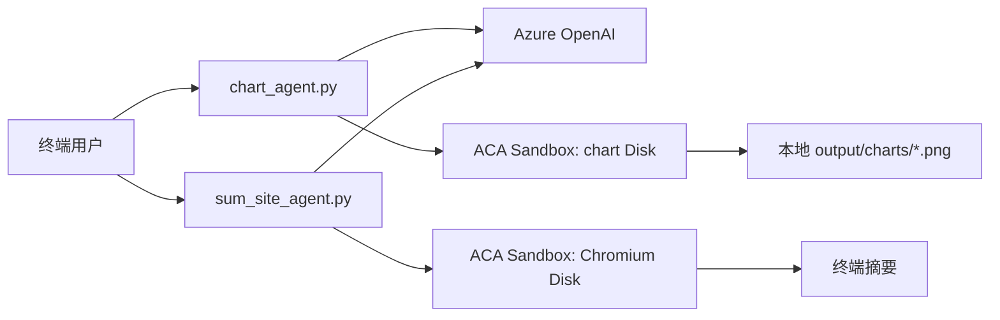

# ACA Sandbox Console Agent POC

这是一个完全独立的 Python POC，包含两个使用 Microsoft Agent Framework 的 console agent：

- `chart_agent.py`：根据文字需求和内嵌数据生成图表。模型生成的 Python 只在 Azure Container Apps Sandbox 中运行，图表 PNG 下载到本机 `output/charts`。
- `sum_site_agent.py`：抓取用户明确指定的公开网站并输出摘要。页面抓取和 Chromium SPA 渲染只在 ACA Sandbox 中运行，摘要只显示在终端。

`sandboxes/` 包含两个构建自定义 Sandbox Disk 所需的独立镜像上下文，不是额外 agent。

希望继续尝试标准问答与 ACA Scheduled Job 的用户，可进入独立的[高级实验](advanced/aca-scheduled-job/README.md)。该目录有自己的依赖、配置、测试和 Docker 构建上下文，不影响本基础 POC。

## 架构和安全边界



chart agent 会上传模型生成的绘图脚本到短生命周期 Sandbox，执行后仅下载 PNG。sum-site agent 不运行模型生成的抓取脚本，而是执行镜像中固定的 `fetch_runner.py`。该 runner 会：

- 仅允许 `http`/`https` URL，拒绝带用户名或密码的 URL。
- DNS 解析后拒绝私网、环回地址和 `169.254.169.254` 云元数据地址。
- 每次重定向后重新校验 URL，最多 5 次重定向。
- 限制响应体为 5 MB，限制返回模型的 JSON 为 512 KB。
- 先静态抓取；内容明显不足时才通过 Chromium 渲染 SPA。
- 将页面内容作为不可信数据；Agent 不会遵从网页中出现的指令。

## 前置条件

1. Windows、macOS 或 Linux；本 README 示例以 PowerShell 为主。
2. Python 3.13 或 3.14。POC 主程序要求 Python $\ge 3.13$ 且小于 3.15；chart 镜像使用 Python 3.14。
3. 安装 [uv](https://docs.astral.sh/uv/)。
4. 安装 [Azure CLI](https://learn.microsoft.com/cli/azure/install-azure-cli) 并执行 `az login`。两个程序通过 `AzureCliCredential` 操作 ACA Sandbox；若 Azure OpenAI 未配置 API key，也通过该登录身份认证。
5. 安装 Docker Desktop，用于构建两个自定义镜像。
6. 一个可调用的 Azure OpenAI chat deployment，以及一个已存在的 Azure Container Apps Sandbox Group。
7. 一个可将本地镜像推送到的容器镜像仓库，例如 Azure Container Registry。创建两个 ACA Sandbox Disk 时，确保 Sandbox Group 能访问对应镜像。

本机用户至少需要对 Sandbox Group 具有创建、执行、读取/写入文件和删除 Sandbox 的权限；对 Azure OpenAI 使用 Entra ID 时，还需要该资源的模型调用权限。请由订阅管理员按组织最小权限规范分配角色。

## 首次安装

在工作区根目录执行：

```powershell
uv sync
Copy-Item .env.example .env
```

编辑 `.env`，填入实际值。`.env` 已被 Git 忽略，绝不要提交 API key、订阅 ID 或 Disk ID。

| 变量 | 用途 |
| --- | --- |
| `AZURE_OPENAI_ENDPOINT` | Azure OpenAI endpoint，例如 `https://example.cognitiveservices.azure.com/`。 |
| `AZURE_OPENAI_API_KEY` | 可选 API key。留空时，两个 Agent 改用当前 `az login` 身份。 |
| `AZURE_OPENAI_CHAT_DEPLOYMENT_NAME` | 可用于 Agent Framework function calling 的 chat deployment 名称。 |
| `OPENAI_API_VERSION` | API version，默认 `2025-03-01-preview`。 |
| `ACA_SANDBOX_REGION` | Sandbox Group 所在 Azure 区域。 |
| `AZURE_SUBSCRIPTION_ID` | Sandbox Group 所属订阅。 |
| `ACA_SANDBOX_RESOURCE_GROUP` | Sandbox Group 所在资源组。 |
| `ACA_SANDBOX_GROUP` | 已创建的 ACA Sandbox Group 名称。 |
| `CHART_SANDBOX_DISK_ID` | 由 chart 自定义镜像创建的 ACA Sandbox Disk ID。 |
| `SUM_SITE_SANDBOX_DISK_ID` | 由 fetch-site 自定义镜像创建的 ACA Sandbox Disk ID。 |
| `CHART_OUTPUT_DIR` | 图表本地保存目录，默认 `output/charts`。 |
| `SUM_SITE_SAVE_OUTPUT` | 是否同时将网站摘要保存为 `output/sum-sites/*.md`；设置为 `true` 启用，默认关闭。 |
## 构建两个 Sandbox 镜像

### Chart 镜像

`sandboxes/chart` 的镜像预装 Matplotlib、Seaborn 与 SimHei 字体。`chart_agent.py` 的提示词要求绘图代码使用 SimHei，从而正确显示中文。

```powershell
docker build -t YOUR_REGISTRY.azurecr.io/aca-chart-sandbox:1.0 .\sandboxes\chart
docker push YOUR_REGISTRY.azurecr.io/aca-chart-sandbox:1.0
```

### SPA 抓取镜像

`sandboxes/fetch-site` 的镜像预装 Playwright 和 Chromium，并包含固定的 `fetch_runner.py`。不要把 runner 替换成由模型生成的代码。

```powershell
docker build -t YOUR_REGISTRY.azurecr.io/aca-sum-site-sandbox:1.0 .\sandboxes\fetch-site
docker push YOUR_REGISTRY.azurecr.io/aca-sum-site-sandbox:1.0
```

## 创建 ACA Sandbox Disk

在 Azure 门户或你组织已验证的 ACA Sandbox 管理流程中，为上述两个镜像分别创建自定义 Sandbox Disk。创建后取得两个 Disk 的资源 ID，分别设置到 `.env` 的 `CHART_SANDBOX_DISK_ID` 和 `SUM_SITE_SANDBOX_DISK_ID`。

Disk 必须位于与 `ACA_SANDBOX_GROUP` 匹配的可用区域并能被该 Group 使用。因为 ACA Sandbox 的自定义 Disk 管理命令和预览扩展会随 CLI 版本变化，本 POC 不内置可能过期的资源创建命令；应使用 Azure 门户或团队当前已验证的管理脚本。程序运行时只通过 Disk ID 创建 Sandbox，不会构建镜像、推送镜像或创建 Azure 资源。

## 运行

### 图表 Agent

```powershell
uv run python chart_agent.py
```

示例输入：

```text
为以下季度销售额生成带数值标签的柱状图，标题为“2025 季度销售额”：Q1=120, Q2=180, Q3=160, Q4=230
```

程序成功后会打印完整 PNG 路径，例如 `C:\...\output\charts\chart-<uuid>.png`。用户自行使用图片查看器打开该文件。

### 网站摘要 Agent

```powershell
uv run python sum_site_agent.py
```

示例输入：

```text
请总结 https://example.com
```

对于 SPA，可输入网站主页 URL。runner 会先尝试普通 HTTP 抓取，只有内容不足时才启动 Chromium。输入 `exit`、`quit` 或 `退出` 结束任一 Agent。
当 `SUM_SITE_SAVE_OUTPUT=true` 时，每次成功返回的终端摘要还会写入 `output/sum-sites/sum-site-<uuid>.md`。

## 验证

不访问 Azure 的本地检查：

```powershell
uv run python -m py_compile chart_agent.py sum_site_agent.py sandboxes/fetch-site/fetch_runner.py
uv run pytest
```

配置了可用 `.env` 后，分别运行两个 console agent 完成冒烟测试。成功标准是：chart agent 在本地输出可打开的 PNG；sum-site agent 能总结公开页面，并对私网或元数据 URL 返回抓取失败而非访问该地址。

## 常见问题

- `请在 .env 中配置 ...`：从 `.env.example` 复制并填写对应值，不要保留 `YOUR_` 占位符。
- `AzureCliCredential` 认证失败：执行 `az login`，并用 `az account set --subscription <订阅 ID>` 选择与 `.env` 一致的订阅。
- Sandbox 创建失败：检查资源组、区域、Group 和 Disk ID；确认当前身份具有 Sandbox Group 所需权限。
- `python3`、`seaborn` 或 `SimHei` 缺失：chart Disk 不是由 `sandboxes/chart` 镜像创建。重新构建、发布并创建正确 Disk。
- `/opt/sum-site/fetch_runner.py` 不存在或 Chromium 启动失败：sum-site Disk 不是由 `sandboxes/fetch-site` 镜像创建。
- 网站被拒绝：这是预期的 SSRF 防护。只允许可 DNS 解析为公网 IP 的公开 HTML 页面。
- 图表脚本错误：chart agent 会把第一次 Sandbox 错误反馈给模型自动修复一次；若仍失败，请简化数据描述后重试。
## 清理

程序会在每次执行后删除短生命周期 Sandbox。按需删除本地 `output/charts` 文件；镜像、Sandbox Disk、Sandbox Group 和 ACR 的长期资源由其所有者按组织流程清理。
