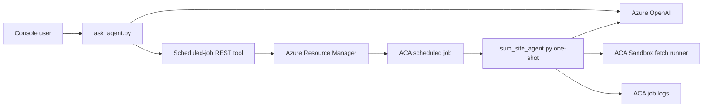

# ACA Scheduled Website Summary Implementation Plan

## Status

Ready for Validation

## Objective

Extend the existing Python POC with an `ask_agent.py` console application. It answers ordinary questions directly and, for requests such as "summarize this website every day at 8 AM", invokes a narrowly scoped tool that creates or updates an Azure Container Apps scheduled job through the Azure Resource Manager REST API.

The scheduled job runs `sum_site_agent.py` once, receives the requested website URL through an environment variable, prints the summary to job logs, and exits successfully.

## Confirmed Decisions

- Existing application mode: modify the current repository; do not create a new Azure project or replace current Sandbox resources.
- Schedule scope: daily schedules with hour and minute extracted by the agent tool call.
- Time zone: read the default from `ACA_JOB_DEFAULT_TIMEZONE`, defaulting to `Asia/Shanghai` (UTC+8). Convert local wall-clock time to the five-field UTC cron required by ACA. Reject ambiguous or unsupported scheduling requests rather than guessing.
- Time-zone validation: accept an IANA zone only when its UTC offset is stable across a representative multi-year calendar check. Reject DST or other offset-changing zones because one ACA UTC cron cannot preserve the requested wall-clock time year-round.
- Idempotency: derive a stable, ACA-compatible job name from the normalized URL using an application-owned prefix, a readable host slug, and a preserved SHA-256 suffix. Update the same job via ARM `PUT` when the schedule changes.
- Registry authentication: use registry username/password stored as an ACA job secret, as requested. Never expose the password in tool output, logs, or a plain container environment value.
- Job model authentication: the local agent may use an API key or Azure CLI identity, but the scheduled container cannot use `AzureCliCredential`. In this first version, require `AZURE_OPENAI_API_KEY` for Job runtime and inject it through an ACA Job secret and `secretRef`. Managed identity is a later hardening option.
- ARM API: use `PUT /subscriptions/{subscriptionId}/resourceGroups/{resourceGroupName}/providers/Microsoft.App/jobs/{jobName}?api-version=2025-07-01`.
- Responsibility boundary: the model routes intent and supplies typed URL/hour/minute/time-zone arguments. Deterministic code revalidates every argument, configuration value, Job name, URI, and payload before token acquisition or network access.
- Network boundary: preflight URL checks cover syntax, HTTP(S), host presence, and embedded credentials. DNS, redirect, private-address, metadata-address, and size checks remain in the fixed Sandbox runner at execution time.
- Deployment execution is out of scope: code, container recipe, configuration template, tests, and documentation will be prepared, but no Azure resource will be created during implementation or tests.

## Specification Review

The specification is feasible in the current repository and has no blocking contradiction. The implementation must preserve these clarified boundaries:

- FR-012 applies to the local ARM caller only; it does not provide authentication inside the scheduled container.
- FR-017 requires the first version to copy the OpenAI key and registry password into each managed Job secret. This is acceptable for the requested scope but increases secret duplication; README must identify managed identity as the preferred future hardening path.
- FR-005/006 validation before creation is not the complete SSRF defense. FR-022 remains essential because DNS and redirect destinations are knowable only when the Job executes.
- The default API version is application configuration, never a model/tool argument. Exact request and payload tests are required so an API-version change is explicit.
- "No URL or explicit time" clarification behavior is primarily an agent-routing contract and cannot be proven by pure helper tests alone; tests need a fake model/tool-call boundary as well as deterministic validation tests.

## Architecture

1. `ask_agent.py` creates the existing Azure OpenAI chat client pattern and registers only a `create_scheduled_website_summary` tool. It owns conversation and routing, not ARM payload construction.
2. For normal questions, the model answers without calling a tool.
3. A new `scheduled_summary_job.py` owns pure URL/time-zone/cron/name validation, configuration loading, bounded payload construction, and a mockable ARM request boundary.
4. For a daily website-summary request, agent instructions require explicit URL, integer hour, and integer minute. The tool deterministically normalizes the URL, validates the configured IANA time zone, converts it to UTC cron, then obtains an ARM token for `https://management.azure.com/.default` with `AzureCliCredential` and performs an idempotent REST `PUT`.
5. The payload configures one scheduled replica with the new sum-site Job image and injects `SUM_SITE_URL` as a non-secret environment variable. Azure OpenAI API key, registry password, and any other secret values use `configuration.secrets` plus `secretRef`.
6. At execution time, the Job container starts `sum_site_agent.py`. The script detects `SUM_SITE_URL`, runs exactly one summary request, prints it to stdout, and exits. Without that variable it preserves the current interactive console behavior.
7. The existing `sum_site_agent.py` still creates a short-lived ACA Sandbox from `SUM_SITE_SANDBOX_DISK_ID` to fetch the public site securely.

## Configuration

Add these settings to `.env.example` and document them in `README.md`:

| Variable | Purpose |
| --- | --- |
| `ACA_JOB_SUBSCRIPTION_ID` | Subscription containing the target Container Apps environment and jobs; may fall back to `AZURE_SUBSCRIPTION_ID`. |
| `ACA_JOB_RESOURCE_GROUP` | Resource group where scheduled jobs are created. |
| `ACA_JOB_ENVIRONMENT_ID` | Full ARM resource ID of the existing Container Apps managed environment. |
| `ACA_JOB_IDENTITY_ID` | Full ARM resource ID of an existing user-assigned identity with Sandbox permissions. |
| `ACA_JOB_LOCATION` | Azure location for the job resource. |
| `ACA_JOB_IMAGE` | Fully qualified image and immutable tag for the new sum-site Job image. |
| `ACA_JOB_DEFAULT_TIMEZONE` | Default IANA time zone, `Asia/Shanghai` when omitted. |
| `ACA_JOB_NAME_PREFIX` | Optional stable prefix, default `sum-site`. |
| `ACA_JOB_API_VERSION` | Optional ARM API version override, default `2025-07-01`. |
| `ACA_JOB_CPU` | Optional CPU value, default `0.5`. |
| `ACA_JOB_MEMORY` | Optional memory value, default `1Gi`. |
| `ACA_JOB_REPLICA_TIMEOUT` | Optional timeout in seconds, default `1800`. |
| `ACA_JOB_REPLICA_RETRY_LIMIT` | Optional retry count, default `0`. |
| `ACA_JOB_REGISTRY_SERVER` | Private registry server. |
| `ACA_JOB_REGISTRY_USERNAME` | Private registry username. |
| `ACA_JOB_REGISTRY_PASSWORD` | Private registry password; copied only into the ACA job secret payload. |
| `SUM_SITE_URL` | Runtime URL passed by the scheduled job to `sum_site_agent.py`; not normally set in the local `.env`. |

The Job also needs the existing Azure OpenAI, Sandbox region/group/disk, and subscription/resource-group variables. Job and Sandbox resource groups remain separate. In this version `AZURE_OPENAI_API_KEY` is required for Job runtime; all secret values use deterministic Job secret names and container `secretRef` entries.

## Implementation Steps

1. Add `scheduled_summary_job.py` with typed request/config/result models; strict URL/hour/minute/time-zone validation; UTC cron conversion; stable hashed naming; configuration loading; exact URI/payload builders; sanitized errors; and a mockable standard-library HTTP boundary.
2. Add focused pure tests first. Validate all arguments and required environment values before creating `AzureCliCredential` or making HTTP calls. Return only job name, resource ID/provisioning state when available, normalized URL, UTC cron, and time zone.
3. Add `ask_agent.py` with concise scheduling instructions and ordinary Q&A behavior. Register only the typed create/update tool from `scheduled_summary_job.py`; do not expose configuration, raw ARM JSON, deletion, start, stop, or enumeration parameters.
4. Add routing tests with fake agent/tool boundaries proving normal Q&A and incomplete requests cause no write, while a valid request causes one bounded tool call.
5. Update `sum_site_agent.py` with reusable agent construction and `run_summary(request)` paths plus a `SUM_SITE_URL` one-shot entry path. Preserve the existing interactive loop and current fetch security controls; make one-shot failures return nonzero.
6. Add `jobs/sum-site/Dockerfile`, built from repository root with `docker build -f jobs/sum-site/Dockerfile ... .`, that installs locked production dependencies, copies only required runtime files, runs as a non-root user, and starts the script with an exec-form entrypoint.
7. Add a repository-root `.dockerignore` covering `.env`, `.git`, virtual environments, caches, tests, specs, output, and developer files while retaining required Job source and lock metadata.
8. Update `.env.example` with placeholders and safe defaults. Keep secrets as placeholders only.
9. Expand tests (split into focused files if clearer) to cover scheduling/payload logic, agent routing, and one-shot execution without any live Azure calls.
10. Update `README.md`: describe the third agent and revised architecture; list prerequisites and RBAC; document all variables; show image build/push steps; show `ask_agent.py` usage; explain UTC conversion, idempotent replacement, secret handling, execution/log verification, troubleshooting, and cleanup of individual jobs.
11. Regenerate the `uv` lock file only if dependency changes require it. Prefer the existing dependency set and Python standard library where practical.

## REST Payload Contract

The tool will send a bounded payload with this shape:

- `location`: `ACA_JOB_LOCATION`
- `properties.environmentId`: `ACA_JOB_ENVIRONMENT_ID`
- `properties.configuration.triggerType`: `Schedule`
- `properties.configuration.scheduleTriggerConfig`: UTC `cronExpression`, `parallelism: 1`, `replicaCompletionCount: 1`
- `properties.configuration.replicaRetryLimit`: `0`
- `properties.configuration.replicaTimeout`: configured timeout
- `properties.configuration.secrets`: registry password and runtime secret environment values
- `properties.configuration.registries`: registry server, username, and `passwordSecretRef`
- `properties.template.containers[0]`: fixed container name, configured image/resources, `SUM_SITE_URL`, existing non-secret settings, and secret refs for secret settings

The URL is normalized using shared deterministic validation before naming or payload generation. The model cannot choose subscription, resource group, environment ID, image, credentials, CPU, memory, API version, secret names, container command, or arbitrary ARM properties.

## Security And Permissions

- The identity running `ask_agent.py` needs `Microsoft.App/jobs/write` and `Microsoft.App/jobs/read` at the narrowest practical target scope, plus the managed-environment join/read permissions required by the platform. `Container Apps Contributor` is the documented broad built-in option; a reviewed custom role is preferred for least privilege.
- The identity running the scheduled container needs the current ACA Sandbox permissions and Azure OpenAI model invocation permission when API keys are not used.
- Registry credentials and Azure OpenAI API keys must never be printed. ARM errors must be reduced to status, Azure error code, and message without echoing the request body or authorization header.
- The tool supports create/update only. It does not delete, start, stop, enumerate, or accept arbitrary ARM JSON.
- URL validation remains defense in depth: local normalization occurs before resource creation, while the fixed fetch runner performs DNS and redirect SSRF checks at execution time.

## Validation

Focused local checks, in order:

1. Unit test that `08:00 Asia/Shanghai` maps to `0 0 * * *` UTC, another stable-offset zone maps correctly, and an offset-changing zone is rejected.
2. Unit test that missing/invalid URL, time, time zone, required env values, and malformed registry settings fail before credential acquisition or HTTP calls.
3. Unit test that equivalent normalized URLs produce the same valid job name and schedule changes retain that name.
4. Unit test the exact ARM URI and critical payload fields, including `SUM_SITE_URL`, UTC cron, secret refs, one replica, timeout, image, and environment ID; assert no secret appears in returned tool text.
5. Unit test mocked `200`, `201`, and Azure error responses.
6. Unit test agent routing: ordinary Q&A and incomplete schedules make no write; one valid daily request makes exactly one bounded tool call.
7. Unit test `sum_site_agent.py` one-shot mode invokes one agent request, never calls `input()`, prints once, and returns nonzero on failure while interactive mode remains available.
8. Run `uv run python -m py_compile ask_agent.py scheduled_summary_job.py chart_agent.py sum_site_agent.py sandboxes/fetch-site/fetch_runner.py`.
9. Run `uv run pytest` and confirm no test acquires a live token or calls Azure.
10. Build the Job image locally to validate the Dockerfile and non-root runtime when Docker is available. Do not push or create Azure resources without a separate deployment request.

## Documentation Runbook

The README instructions will include:

1. Build and push the dedicated Job image with an immutable tag.
2. Configure `.env` for the local `ask_agent.py` and for the Job template values.
3. Ensure the target Container Apps environment exists and the caller has required RBAC.
4. Run `uv run python ask_agent.py` and submit a sample daily-summary request.
5. Confirm the created job with Azure Portal or `az containerapp job show`, inspect scheduled execution history/logs, and explain that ACA cron is UTC.
6. Update the same URL schedule by asking again, demonstrating stable-name idempotency.
7. Delete an individual test job explicitly during cleanup; never delete the entire resource group as the default cleanup instruction.

## Known Constraints

- The first implementation supports daily hour/minute schedules, not arbitrary recurring natural-language calendars.
- ACA scheduled cron is UTC and does not carry a time zone. IANA zones with daylight-saving transitions cannot preserve a fixed local wall-clock time year-round with one static cron expression. The tool will reject such zones for daily schedules unless the requested date-independent offset is stable; `Asia/Shanghai` is stable and supported.
- Job output is written to ACA logs. This scope does not add email, chat, blob, or database delivery.
- ARM `PUT` is idempotent by resource name but replaces the desired job configuration built by this application. The stable namespace should therefore be dedicated to this tool.

## Approval Gate

After approval, implement only the application, Docker, tests, environment template, and README changes above. Do not execute Azure deployment operations. After implementation, update this plan status to `Ready for Validation` and run local validation; any later Azure deployment must follow a separate validation and explicit deployment request.
